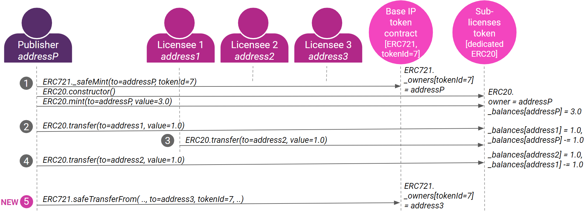
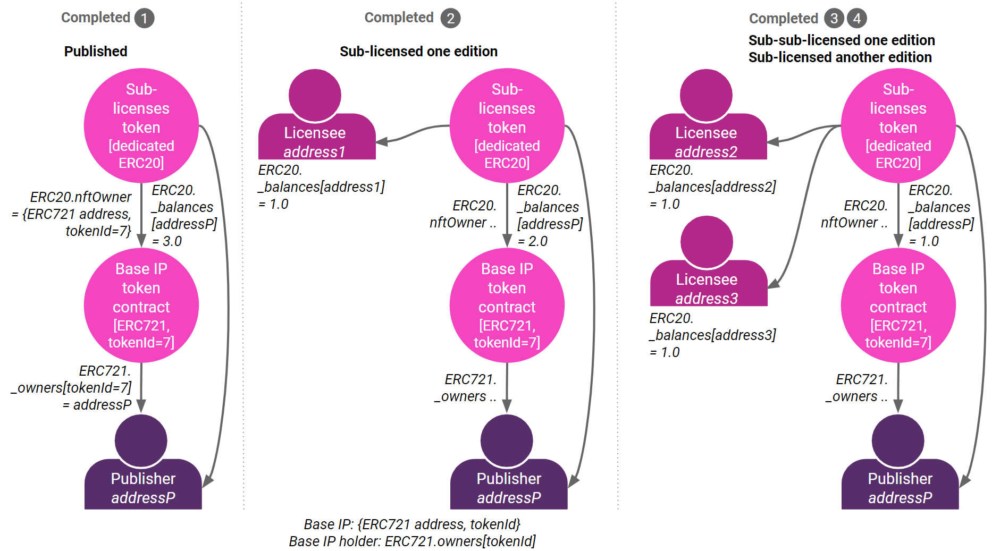

# ERC741

ERC741 is not real ERC btw, just the math sum from ERC721+ERC20 = ERC741 :D

## Overview

This Substrate pallet connecting NFT with Intelectual Property (IP), based on article by Trent McConaghy: https://blog.oceanprotocol.com/nfts-ip-3-combining-erc721-erc20-b69ea659115e

Inspired by combining non-fungible token standard ERC721 to manage assets and fungible token standard ERC20 to manage shares.

