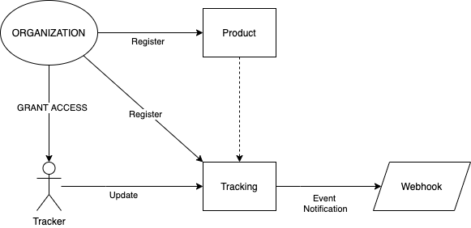

# Nuchain Product Tracking module

The Product Tracking module provides functionality for registering and tracking production pipeline, and monitoring their storage and transportation conditions, within a fictitious supply chain between various stakeholders.
The high-level flow is shown below:

This module is part of the [Nuchain Network](https://github.com/nusantarachain/nuchain).

It is inspired by existing projects & standards:
- [IBM Food Trust](https://github.com/IBM/IFT-Developer-Zone/wiki/APIs)
- [Hyperledger Grid](https://www.hyperledger.org/use/grid)
- [GS1 Standards](https://www.gs1.org/standards)
